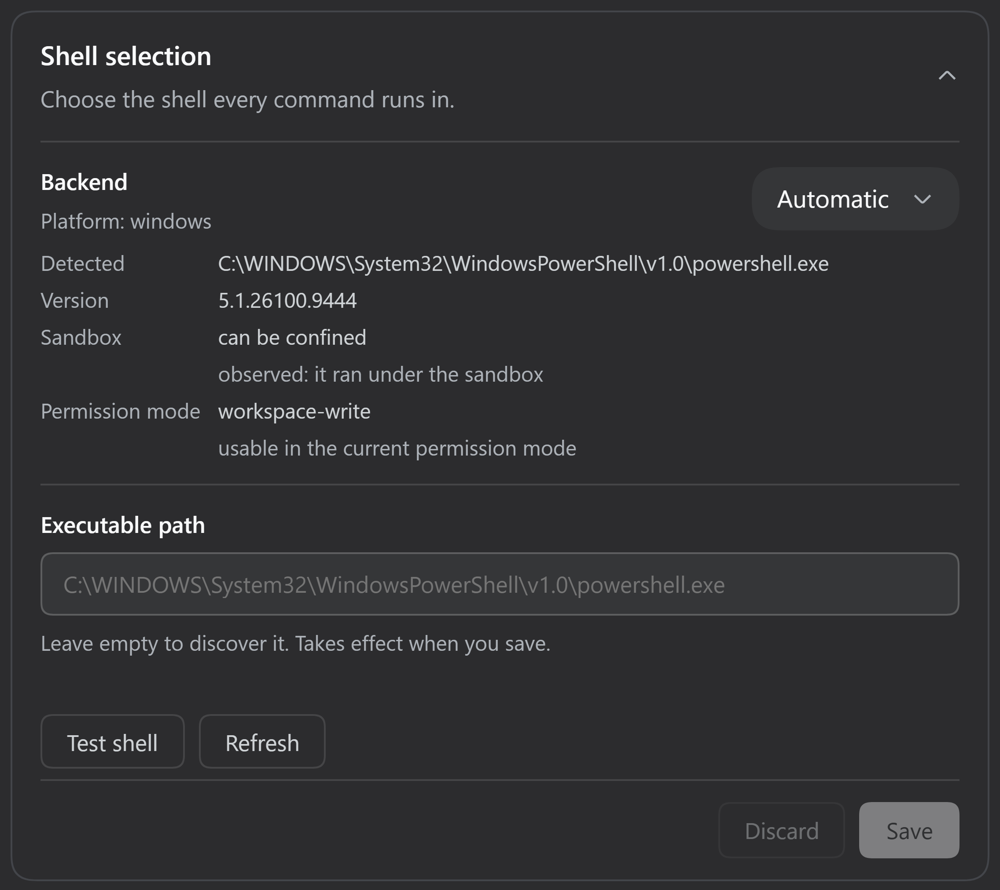

# dsh-shell-select

[](LICENSE)

Choose which shell DeepSeek Harness runs agent commands in. PowerShell, Windows
PowerShell, `cmd.exe`, Git Bash, WSL Bash, `bash`, `zsh`, `fish`, or the system
`sh`: you pick one, it is stored as a setting, and every agent command uses it.

The selection belongs to the deployment, not to the model. Agents get a single
`shell` tool and cannot choose a different shell for one command, and a shell the
current permission mode cannot confine is refused rather than run outside the
sandbox.



## Features

- **One shell for every agent command.** The selector becomes `ctx.shell`, so the
  `shell` tool, hook commands, and the harness's own probes all run through it.
  The shipped `bash` and `pwsh` tools are denied with a reason naming `shell`.
- **Discovery, with an explicit override when you want one.** Shells are found by
  name through the harness's own executable resolution. Set `executable` when a
  shell lives somewhere unusual, or when two installs of it exist.
- **Persistent and editable in the Web UI.** The choice lives in your DSH
  settings document under `shell-select` and is managed from a
  **Settings → Plugins → Shell selection** card with Save, Discard, and a Test
  action.
- **The model is told what the selected shell needs.** Each shell carries its own
  syntax notes (PowerShell paths, `cmd` variable expansion, WSL's `/mnt/...`
  paths, fish's non-POSIX syntax), so the agent writes commands that fit.
- **Runs inside the harness's existing sandbox.** Deadlines, output limits,
  background jobs, and confinement come from the harness unchanged; this plugin
  adds no execution machinery of its own.

## Quick start

Install into a dsh profile, which is a pnpm project under `~/.dsh/profiles/<name>`:

```sh
dsh plugin --profile web add dsh-shell-select
```

The command forwards its arguments to pnpm in the profile directory and then
registers the package as a bundle layer in `dsh.profile.bundles` for you. Existing
entries in that list are left alone, so there is nothing to edit by hand. A
running profile keeps the bundle set it started with, so restart it:

```sh
dsh web          # the same as dsh --profile web
```

Then, in the app:

1. Open **Settings → Plugins** and expand **Shell selection**.
2. Choose a shell from the dropdown. Automatic, the default, picks a shell for
   you and says which one it resolved to.
3. Press **Save**. Until you do, the edit is staged and nothing runs differently.
4. Press **Test shell** to run one fixed command through the selection.

**Test shell runs the saved selection, not the edits staged in the card.** If it
reports a refusal, that refusal is what a command would get right now.

### Installing from a checkout

```sh
git clone https://github.com/athif23/dsh-shell-select
dsh plugin --profile web add link:/absolute/path/to/dsh-shell-select
```

A `link:` install keeps the checkout live, so editing the plugin and restarting
the profile is enough to see a change. The plugin installs into a profile that
already provides the harness, because it declares the harness packages as peer
dependencies rather than carrying a second copy of them.

## Supported shells and compatibility

| Platform | Catalog entries | Executed through the plugin | Confinement verified |
|---|---|---|---|
| Windows (primary) | `pwsh`, `powershell`, `cmd`, `gitbash`, `wsl` | PowerShell 5.1, `cmd.exe`, Git Bash, WSL Bash | `cmd.exe` and PowerShell 5.1, yes. Git Bash and WSL Bash, no |
| Linux (secondary) | `bash`, `zsh`, `fish`, `sh`, `pwsh` | `bash`, `sh`, and `pwsh` on the CI runner; `bash`, `zsh`, and `sh` by an independent review | yes, for `bash` on the CI runner |
| macOS (unverified) | `bash`, `zsh`, `fish`, `sh`, `pwsh` | none | no |

"Catalog entries" means the plugin can select the shell and build its arguments.
"Executed through the plugin" means someone ran agent commands with it. The last
column is stricter than both: it means a write outside the workspace was actually
denied, which the suite asserts wherever the runner's profile promises it.

**Windows is the primary platform.** There, Git Bash and WSL Bash cannot start
under the restricted token the sandbox uses, so they are refused under
`workspace-write` and `read-only`, including for the card's version probe; they
run only under `danger-full-access`. That refusal is deliberate, since the
alternative would be running a shell the sandbox cannot confine. `pwsh`
(PowerShell 7) is supported and was skipped on the test host only because it is
not installed there.

**Linux is secondary.** The CI runner executes `bash`, `sh`, and `pwsh` through
the plugin and asserts the workspace-write denial, which holds there. An
independent review ran the suites on a Linux host with no usable sandbox backend,
so on that machine the refusal path was what got exercised. `zsh` and `fish` were
installed on neither. **macOS is unverified.** The test workflow runs on Windows
and Linux only; check its latest run rather than trusting a claim here.

Measurements, exceptions, and what remains untested are in
[testing.md](docs/testing.md). The routing rules and execution detail are in
[architecture.md](docs/architecture.md).

## Configuration

Settings live in `~/.dsh/settings.yaml` under the `shell-select` namespace:

```yaml
shell-select:
  shell: gitbash
  loginShell: false
```

| Setting | Default | Meaning |
|---|---|---|
| `shell` | `auto` | A catalog id, or `auto`. |
| `executable` | empty | Explicit path for the selected shell. Wins over discovery. A path that cannot be resolved, or that names a *different* shell, is an error rather than a cue to search. |
| `loginShell` | `false` | Run a bash-family shell with `-l`, which sources your profile scripts on every command. |
| `wslDistro` | empty | WSL distribution name; empty uses the distribution's default. |
| `wslMountRoot` | `/mnt` | Where the distribution mounts Windows drives. |
| `enableRunInBackground` | `true` | Offer `run_in_background` on the `shell` tool. |

The remaining fields are the inherited local executor's budgets, carried through
so one composition row configures the whole executor: `cwd`, `timeoutMs`
(120000), `maxTimeoutMs` (600000), `maxOutputBytes` (64000), `maxSpillBytes`
(67108864), and `graceMs` (3000). `pwshPath` is the harness's own PowerShell path
setting, still honored for the PowerShell entries so an existing value keeps
working.

**Automatic** is the default because it reproduces what the deployment already
does: the first catalog entry that resolves, which on Windows is PowerShell
(what the harness's own executor runs) and on Linux follows a `$SHELL` that names
a catalog entry. An explicit `executable` override changes the answer, because an
override naming a shell claims that shell: setting `executable` to a
`bash.exe` path while `shell` is `auto` runs that bash, with bash's arguments.

A settings change applies to subsequent calls. It never alters a call that is
already being prepared, a running process, or the facts a finished call recorded.

## Troubleshooting and limitations

**No `<shell>` executable found.** The plugin looked for the shell by name and
found nothing. Install it, or set `executable` to its full path. The error lists
every location that was probed.

**Refused under the current permission mode.** The selected shell cannot be
confined by the sandbox the session resolved. On Windows this is expected for Git
Bash and WSL Bash under `workspace-write` and `read-only`. The refusal names the
shell and the mode; pick a shell the mode can confine.

**Automatic shows *unknown*.** You have staged an `executable` path that the host
has not resolved yet. Automatic is resolved from the saved selection, so save the
path and the card will name the shell it picks.

**Test shell reports a refusal or the wrong shell.** Test runs the *saved*
selection. If you have staged edits, save them first, or discard them.

**`cmd` quirks.** The command reaches `cmd.exe` in one pass, so a `%NAME%` in your
command stays literal; write `call echo %CD%` when you need expansion. Non-ASCII
output depends on the console code page, so it can arrive as replacement
characters. Unicode paths and filenames are unaffected.

**Routes the selector does not control.** Agent commands go through the selected
shell, but `run_code` program bodies, PTY-based terminal tools, and out-of-process
subagents spawn their own processes. The full list, with reasons, is in
[architecture.md](docs/architecture.md#execution-routes-covered-and-not-covered).

Shell selection is not destructive-command protection. The sandbox restricts
write-class access according to the session's permission mode; this plugin adds
no destructive-command detection and is not a safety layer. The other known
limitations are listed in [testing.md](docs/testing.md#known-limitations).

## Development

```sh
pnpm install --frozen-lockfile
pnpm test              # every suite
pnpm test:execution    # only the suites that spawn real processes
```

Tests create their fixtures under `<projectRoot>/.test-tmp/<unique-id>/`. They
refuse a root inside the real user profile, so a checkout that lives inside the
profile (a clone in `$HOME`, a CI runner) must name an approved root outside it:

```sh
# Linux, macOS, or Git Bash
DSH_SHELL_SELECT_TEST_TMP=/var/tmp/dsh-shell-select pnpm test
```

```powershell
# Windows: name a path outside the profile, since %TEMP% is inside it
$env:DSH_SHELL_SELECT_TEST_TMP = 'D:\dsh-shell-select-test-tmp'
pnpm test
```

pnpm is the supported installer, pinned by `packageManager`; npm cannot express
the harness workspace's `link:` graph. See
[architecture.md](docs/architecture.md#installation-and-composition) for why the
harness packages are peers, and
[testing.md](docs/testing.md#running-the-suites) for what each suite covers and
which platforms have been exercised.

## License

[MIT](LICENSE), copyright 2026 Muhammad Athif Humam.
